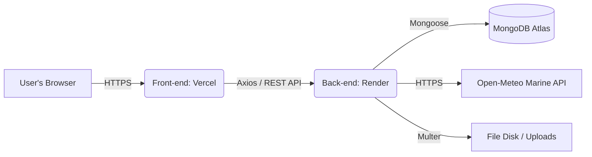

# 🏄‍♂️ SurfAdvisor

> **The Ultimate Surfer's Assistant.**
> Manage your quiver, track statistics, and receive real-time recommendations for the ideal surfboard based on ocean conditions and your surfing level.

[]()
[]()
[]()
[]()
[]()

🌍 **Access the live project:** [SurfAdvisor (Live App)](https://surf-advisor-black.vercel.app/)

## 📖 About the Project

**SurfAdvisor** started as a RESTful API and evolved into a complete Full-Stack application. The system allows surfers to manage their surfboard collections (quiver) visually. The standout feature is the **Smart Recommendation Engine**: using real oceanographic data and crossing it with the surfer's profile, the system recommends the exact surfboard for current ocean conditions.

## 🚀 Features

### 📱 UI and Quiver Management (Front-end)
* **Dynamic Dashboard:** Responsive grid visualization with real-time statistics calculation (Total boards, Accumulated volume, Variety).
* **Smart Modals (React Portals):** "Transformer" components that handle both creation and editing, managing simultaneous image and data uploads (`FormData`), bypassing CSS *Stacking Context* limitations.
* **UX Security:** Deletion flows with safety barriers and optimized UI/Server state synchronization.

### 🔐 Security and Authentication (Back-end)
* User registration with password encryption via `bcrypt`.
* Secure login and sessions using `JWT` (JSON Web Tokens) and `SameSite` Cookie blocking for cross-origin routes.
* End-to-end route protection (Users can only access and manipulate their own data).

### 🌊 Smart Recommendation Engine
* Integration with the **Open-Meteo Marine API** to fetch real-time wave heights at surf spots in Ceará.
* Customized volume and shape calculation algorithm, matching current ocean conditions with the user's biometrics and skill level.

## 🏗️ System Architecture

The project uses a modern **Client-Server** architecture, separating UI rendering responsibilities from business logic processing.


### 📁 Directory Structure
```text
📦 SurfAdvisor
 ┣ 📂 frontend               # React / Vite Interface
 ┃ ┣ 📂 src
 ┃ ┃ ┣ 📂 components         # Modals, Cards, Icons
 ┃ ┃ ┣ 📂 pages            # Home, Login, Register
 ┃ ┃ ┣ 📂 services         # Axios Config / Interceptors
 ┃ ┣ 📜 vercel.json      # SPA routing rules
 ┃ ┗ 📜 package.json
 ┗ 📂 backend                # Node.js / Express Server
   ┣ 📂 src
   ┃ ┣ 📂 controllers      # Business Logic (Users, Boards)
   ┃ ┣ 📂 middlewares      # JWT Validation, Global Error Handling, Multer
   ┃ ┣ 📂 models           # Mongoose Schemas (User, Board)
   ┃ ┗ 📂 routes           # REST API Endpoints
   ┣ 📂 uploads            # Media storage
   ┗ 📜 server.js          # Entry-point and CORS Config
```
## 🖼️ File and Image Strategy

The upload management was designed to support the full flow from the user's device to cloud rendering:

1. **Transport Layer:** The Front-end uses the `FormData` object to bundle the binary file with the board's metadata, sending them via a `multipart/form-data` request.
2. **Processing (Middleware):** On the Back-end, the **Multer** library intercepts the file, generates a unique name based on a *timestamp* (preventing overwrites), and persists it in the local `/uploads` directory.
3. **Data Persistence:** The MongoDB database stores only the *string* with the unique generated file name. The final URL is dynamically built by the Front-end, pointing to the hosting server.

> **⚠️ Infrastructure Note (V1):** Currently, the Back-end server is hosted on **Render's** free tier. This service uses an *Ephemeral Disk* (temporary). As a result, images uploaded to the `uploads` folder do not survive the virtual machine's restart (sleep) cycles.

## 🛠️ Technologies Used

**Front-end Ecosystem:**
* **React.js & Vite:** Core UI development and high-performance build tool.
* **Tailwind CSS:** Utility-first styling for responsive design and animations.
* **Axios:** HTTP client for asynchronous communication with the server.
* **React Portals:** Used to render modals outside the main DOM hierarchy, avoiding *Stacking Context* conflicts.

**Back-end Ecosystem:**
* **Node.js & Express.js:** Runtime environment and routing framework for the REST API.
* **MongoDB Atlas & Mongoose:** Cloud-managed NoSQL database and ODM for data modeling and schema validation.
* **JWT (JSON Web Token) & Bcrypt:** Guarantee of secure sessions (via restricted cookies) and password encryption.
* **Multer:** Middleware for efficient file handling in `multipart/form-data` requests.
